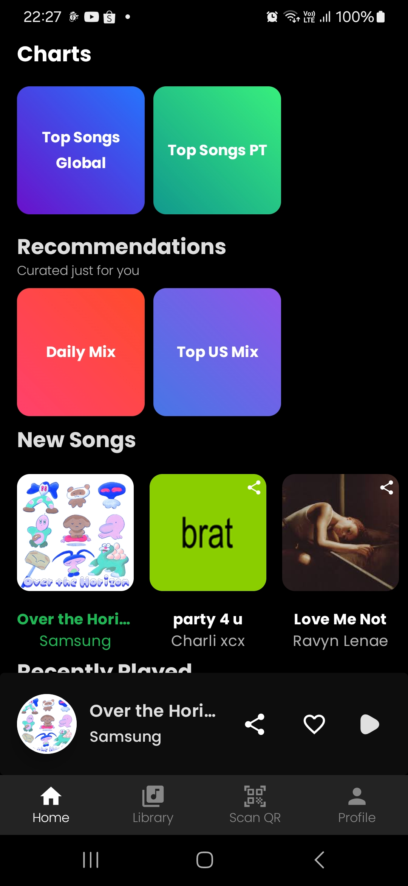
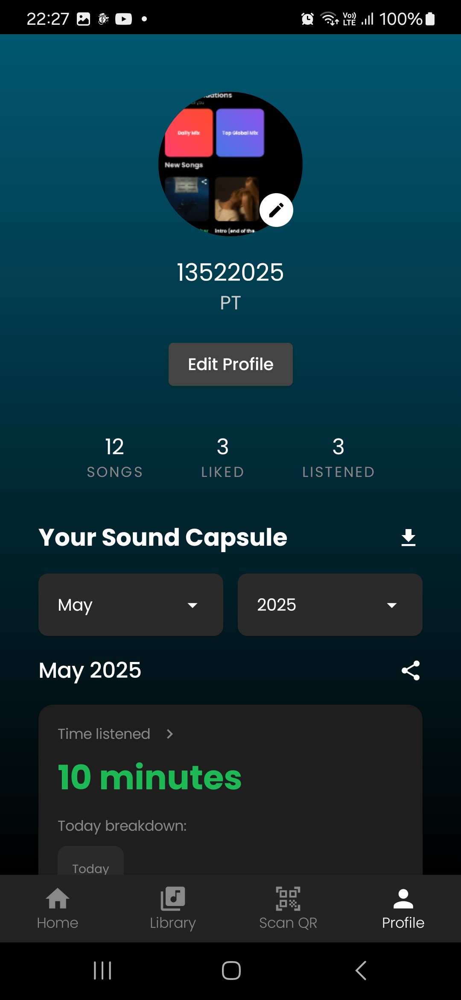

### Purritify

## Application Description

Purritify is an Android music player application built with Jetpack Compose and ExoPlayer. This application allows users to play music from their devices and maintain a personal music collection. The main features of this application include:

- User authentication
- Music playback with complete controls (play, pause, next, previous)
- Playback modes (repeat one, repeat all, shuffle)
- Adding new songs to the collection
- Album art and song metadata display
- Favorite songs 

This application uses the MVVM (Model-View-ViewModel) architecture and leverages modern Android technologies such as Jetpack Compose, Kotlin Coroutines, and Room Database.

## Libraries Used

- **Jetpack Compose**: Modern UI framework for Android
- **ExoPlayer**: Media playback library from Google
- **Room Database**: Data persistence library providing SQLite abstraction
- **Hilt**: Dependency injection framework for Android
- **Retrofit**: HTTP client for Android
- **Kotlin Coroutines & Flow**: For asynchronous programming
- **Coil**: Image loading library for Compose
- **Media3**: New media library from Google (includes ExoPlayer)
- **Accompanist**: Companion library for Jetpack Compose
- **Material Design Components**: UI components following Material Design guidelines

## Screenshots

<div style="display: flex; justify-content: center; flex-wrap: wrap;gap: 2rem;">
    
    
    
    
    
    
    
    
</div>


## Application Security

### M4: **Insufficient Input/Output Validation**

This application performs input validation to ensure that only valid data is stored. For example, when saving the user's email, the application checks that the email has a valid format (contains "@" and ".") before saving it to `DataStore`. This prevents storing invalid data.

```kotlin
suspend fun saveUserInfo(name: String, email: String) {
    if (email.contains("@")) {  // Email format validation
        context.dataStore.edit { prefs ->
            prefs[USER_NAME] = name
            prefs[USER_EMAIL] = email
        }
    }
}
```

### M8: **Security Misconfiguration**

This application does not contain misconfigurations such as using default credentials or unprotected API endpoints. All sensitive data, such as access tokens and refresh tokens, are encoded using Base64 before being saved to `DataStore`. 

```kotlin
suspend fun saveToken(token: String) {
    if (token.isNotBlank()) {
        val encoded = encodeBase64(token)
        context.dataStore.edit { prefs ->
            prefs[TOKEN_KEY] = encoded
        }
    }
}
```

### M9: **Insecure Data Storage**

To prevent storing sensitive data in an insecure manner, such as in plaintext, the application encodes the access token and refresh token using Base64 encoding before storing them in `DataStore`. While Base64 does not provide strong encryption, it offers basic protection against unauthorized access.

```kotlin
private fun encodeBase64(input: String): String {
    return Base64.encodeToString(input.toByteArray(Charsets.UTF_8), Base64.NO_WRAP)
}

private fun decodeBase64(encoded: String): String {
    return String(Base64.decode(encoded, Base64.NO_WRAP), Charsets.UTF_8)
}
```

## Credits

| NIM      | Full Name                 | Responsibilities                                                                                                                | Working Hours                                                                          |
| -------- | ------------------------- | ------------------------------------------------------------------------------------------------------------------------------- | -------------------------------------------------------------------------------------- |
| 13522009 | Muhammad Yusuf Rafi | Library <br> Profile <br> Network Sensing | 10 hours <br> 10 hours <br> 10 hours  |
| 13522025 | Debrina Veisha Rashika W   | Login and Logout <br> Music Player <br> Background Service <br> Likecd Songs | 10 hours <br> 10 hours <br> 5 hours <br> 5 hours  
| 13522035 | Melati Anggraini       | Navbar <br> Add Songs <br> Home  | 10 hours <br> 10 hours <br> 10 hours |

# Total Working Hours

| NIM      | Full Name                 | Total Working Hours |
| -------- | ------------------------- | ------------------- |
| 13522009 | Muhammad Yusuf Rafi       | 30 hours
| 13522025 | Debrina Veisha Rashika W  | 30 hours            |
| 13522035 | Melati Anggraini           | 30 hours            |
